# ZipRipper user guide

**Version 0.5.3 · Apple Silicon · macOS 13+**

Screenshots use synthetic archives and passwords. [Download](https://github.com/BinaryBearsLLC/ZipRipper-MacOS/releases/latest) · [Back to project](../README.md)

## Install and start

1. Open the DMG and drag **ZipRipper** to **Applications**.
2. Open the app and confirm that you own the files or have permission.
3. Run the suggested benchmark, or choose **Later**. It is also available in **Engine**.

Everything needed for recovery is included. No installation of Homebrew, Python or developer tools is required.

Installer and first launch

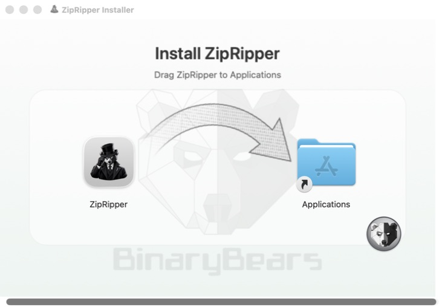

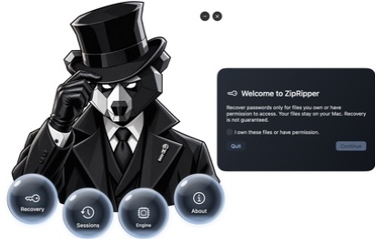
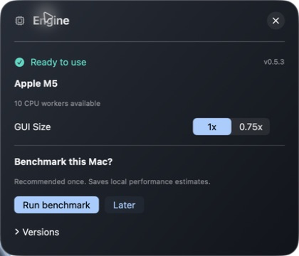

## Four sections

Click a sphere: **Recovery**, **Sessions**, **Engine** or **About**. Drag the bear to move it. **−** minimizes; **×** saves active progress and quits. **⌘1–4** opens sections; **Esc** closes a popup.

## Choose a search

Drop an archive/PDF on **Recovery**, or click **Choose or drop a file**.

| Search | Use it for |
| --- | --- |
| **Common passwords** | A quick attempt using John's bundled `password.lst`. |
| **My wordlist** | An extracted UTF-8 text file, one password per line. |
| **I remember part of it** | A known structure, such as `Summer` plus four digits. |
| **Try every combination** | A small character set and short length range. Two digits means `00` through `99`. |

Huge wordlists are streamed, validated and copied into the session. Allow disk space for this copy. A wordlist containing accents or emoji is supported; the visual Pattern maker uses printable ASCII.

**Try common variations** adds changes such as `bear → Bear`, `bear1` or `bear!`. It can multiply the work by thousands; try a focused list without variations first.

Recovery, search choices and wordlists

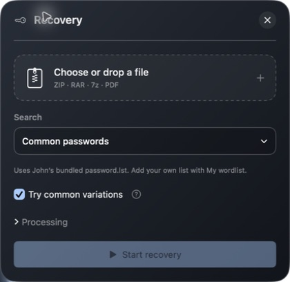
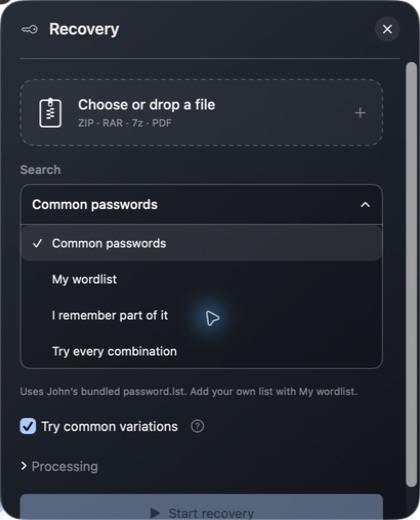
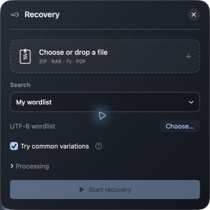
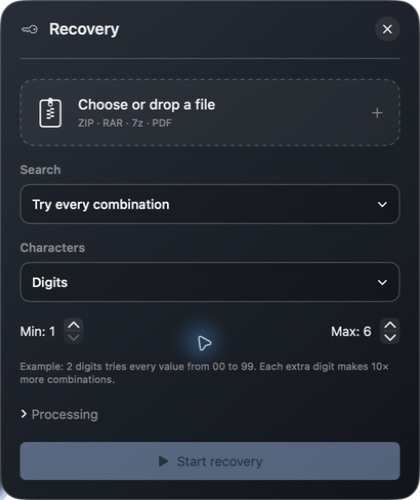
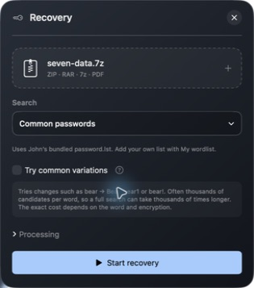

### Pattern maker

Select **I remember part of it**, then **Pattern maker** beside the hints. Add remembered text and variable blocks in order, adjust their counts, then **Use pattern**. **Recovery** goes back without applying changes.

The example changes every two seconds; it does not test passwords or run the recovery engine. It stops when the page closes or the app is inactive, and respects Reduce Motion.

| Token | One character |
| --- | --- |
| `?d` | Digit `0–9` |
| `?l` / `?u` | Lowercase / uppercase ASCII letter |
| `?s` | Symbol (including space) |
| `?a` | Any printable ASCII character |
| `??` | A literal question mark |

`Summer?d?d?d?d` generates passwords such as `Summer2026`. **`???a` means a literal `?` followed by another character**—two positions, not one. Advanced masks remain editable in Recovery; the maker will not silently rewrite them.

Pattern and visual composer

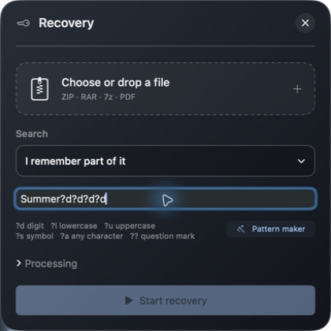
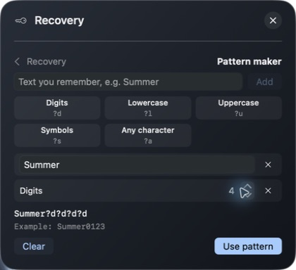

## Run, pause and recover

Click **Start recovery**. The panel shows the active engine, elapsed time, passwords per second and estimated time to exhaust the search. **Remaining** uses progress; **Full search** estimates the whole search. Neither promises when a password will be found. Estimates refresh at most every ten seconds; unknown search sizes remain unestimated.

**Sample** is one candidate from the current batch. **Samples** can contain two CPU candidates separated by `..`; it is not one longer password. **Batch** identifies a Metal batch sample. The moving bar indicates activity, not percentage complete.

Use **Pause & save**, then **Resume**. Keep the original archive accessible and unchanged. On success, **Show**, **Copy** or **Export…** reveals or saves the password. Exports are plaintext. **+** starts another search.

**Exhausted** means no more candidates remain in that search; try a different strategy. **Partial** means some entries remain protected.

Running, paused and recovered states

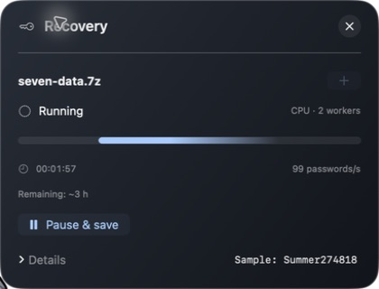
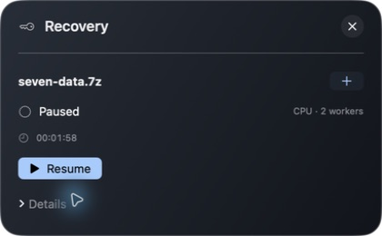
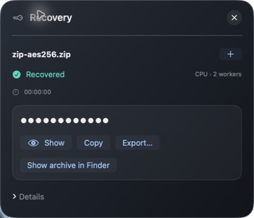
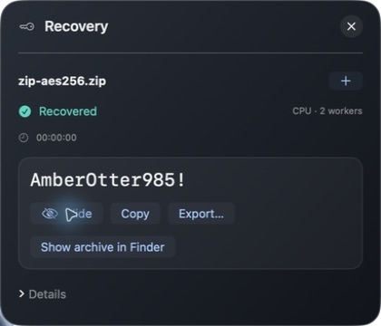

## Sessions

**Orange:** unfinished. **Green:** recovered. Open a saved session with the arrow. The trash button asks before deleting its progress and recovered results; it does not delete the original archive.

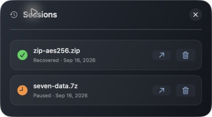

## Engine and benchmark

**Ready to use** confirms the bundled runtime. **Versions** lists its exact components. There are no dependency download/build controls: maintainers test updates and release a new app.

**Automatic** compares CPU and Metal on the file before a new search and keeps that selection on resume. CPU may be faster; GPU is not automatically the best choice. **Processing** also allows explicit CPU/Metal selection and a CPU worker count.

| Format | Metal coverage |
| --- | --- |
| ZIP | Traditional ZipCrypto; WinZip AES-128/192/256 |
| 7z | Supported stored, LZMA2 and truncated records |
| RAR | Supported RAR3 and RAR5 records |
| PDF | Revisions 2–5; revision 6 uses CPU |

John fully verifies GPU survivors. Unsupported variants fall back to CPU; candidate generation and some decompression also use CPU.

The benchmark tests formats sequentially and saves results on the Mac. Results include single-worker CPU, multicore CPU and Metal plus verification where supported. They are references, not universal speed promises. Rerun after hardware, OS or app changes when prompted.

**GUI Size 1x / 0.75x** scales the mascot and in-app controls together. Standard file dialogs retain their system size.

Engine, processing, benchmark and compact view

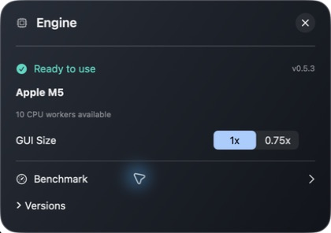
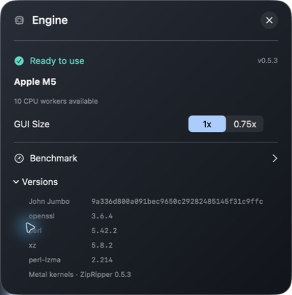
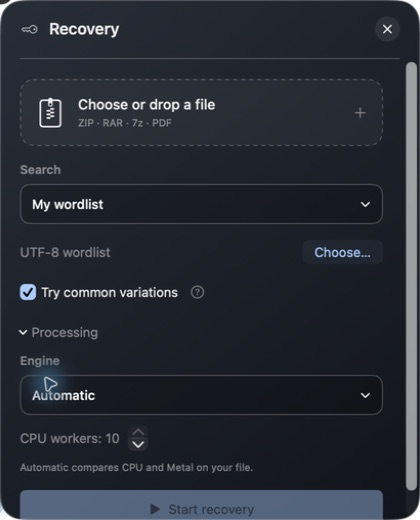
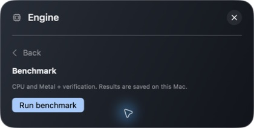
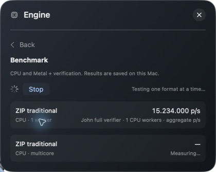
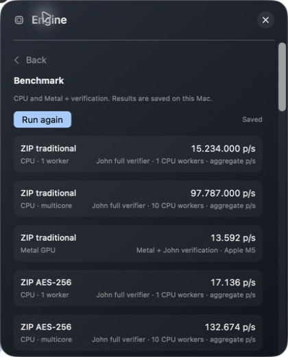

## About and wordlists

**Need a wordlist?** links to Cyclone, SecLists and Weakpass, or to Mentalist for creating your own list. These are external, independent projects. **Licenses & notices** displays bundled texts without requesting folder permissions.

The built-in list is `ZipRipper.app/Contents/Resources/runtime/run/password.lst`. For your own list, use **My wordlist**; do not modify the signed app bundle.

About, resources and embedded notices

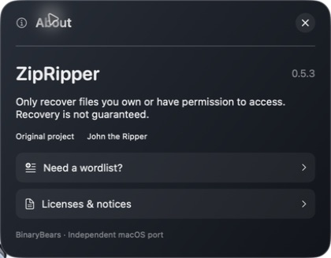
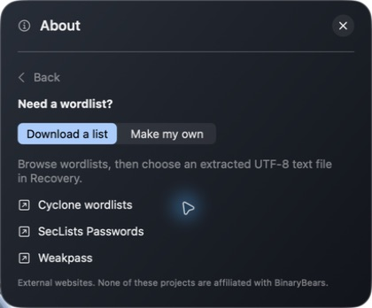
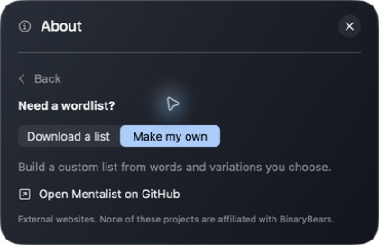
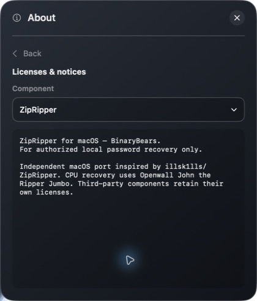

## Local data

Archives and passwords are not uploaded. Recovery makes no network requests; opening an external resource link does.

Sessions live in `~/Library/Application Support/ZipRipper/Sessions/`; the saved benchmark is `benchmark.json` beside that folder. Recovered passwords are plaintext in private session files. **Hide** protects the screen, not the stored result. Candidate samples are transient and redacted from diagnostics.

For a safe first try, use the project's [synthetic test set](../test-files/) and its 2,000-entry wordlist.
